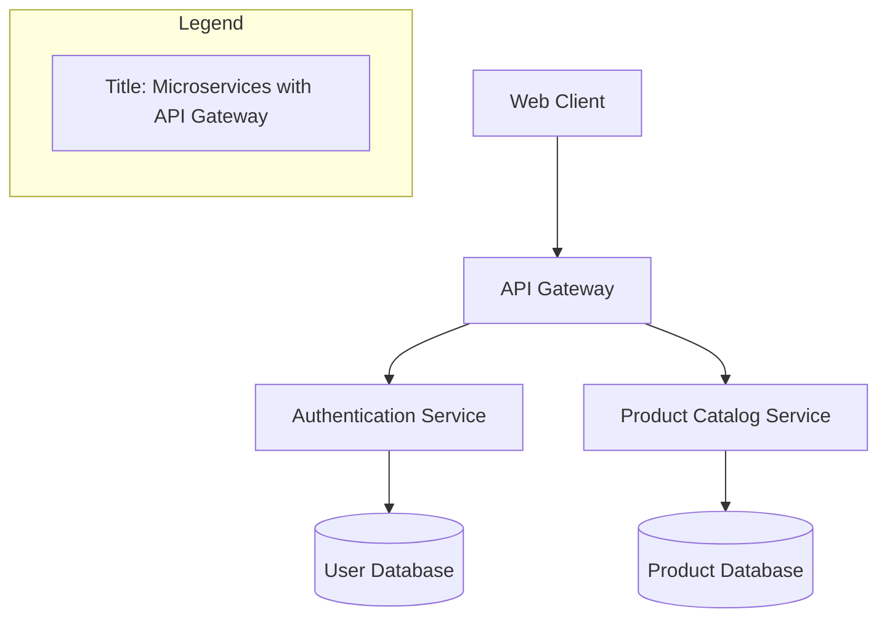

# Software Architecture Diagrams with Mermaid

This repository provides a curated collection of software architecture diagrams generated with Mermaid and assisted by GitHub Copilot in VS Code.

The goal is to offer clear, well-documented, and reusable diagrams that illustrate modern architecture styles and patterns. Use them as educational material, technical documentation, starting points for whiteboarding sessions, or reference models for real-world projects.

## Key Features

- Multiple architecture models: monolithic, layered, client-server, microservices, event-driven, serverless, hexagonal, cloud-native, and more.
- Mermaid-based diagrams: human-readable, easy to edit, and integrable into markdown documentation.
- Copilot-assisted generation: prompts and code examples demonstrate how GitHub Copilot can automate and accelerate the creation of architecture diagrams.
- Well-documented examples: every diagram includes comments that explain the roles of components and their interactions.
- Consistency and clarity: components use explicit, descriptive names (e.g., `Web Client`, `API Gateway`, `Authentication Service`, `PostgreSQL Database`).
- Comparison of alternatives: side-by-side visualization of different architectures to highlight trade-offs and design choices.

## Example

## Quick start

1. Clone the repository and open it in VS Code.
2. Install the recommended extensions (VS Code will prompt from `.vscode/extensions.json`).
3. Open any diagram file (under `diagrams/`) and press `Ctrl+Shift+V` to preview it. If you use the Mermaid extension, run the "Markdown: Open Preview to the Side" command for live updates.
4. Tweak the Mermaid code and re-run the preview to iterate quickly.

## Generate new diagrams with Copilot

Prompts in `prompts/copilot-prompts.md` help Copilot produce consistent Mermaid diagrams. Copy a prompt, replace placeholders (architecture style, domain, constraints), and ask Copilot to expand it in a Markdown file. Each prompt enforces explicit component names, inline comments, and optional variants so the output matches the rest of this catalog.

## Structure

- `diagrams/`: Mermaid diagram files grouped by architecture style
- `prompts/`: Copilot prompt templates to generate/extend diagrams
- `.vscode/`: recommended extensions for better authoring experience

## Diagram Library

- Monolithic: [Traditional Monolithic Application](diagrams/monolith/monolithic-basic.md)
- Layered: [Layered (n-tier) Architecture](diagrams/layered/layered-architecture.md)
- Client-Server: [Client-Server with Reverse Proxy](diagrams/client-server/client-server-basic.md)
- Microservices:
  - [API Gateway with BFFs](diagrams/microservices/api-gateway-bff.md)
  - [Saga Pattern (Orchestration)](diagrams/microservices/saga-orchestration.md)
  - [Saga Pattern (Choreography)](diagrams/microservices/choreography/saga-choreography.md)
  - [Microservices with Dynatrace Monitoring](diagrams/microservices/microservices-dynatrace.md)
- Event-Driven: [Event-Driven Architecture with CQRS](diagrams/event-driven/event-driven-cqrs.md)
- Serverless: [Serverless Web Backend](diagrams/serverless/serverless-web-backend.md)
- Cloud-Native: [Kubernetes with Service Mesh](diagrams/cloud-native/cloud-native-k8s-istio.md)
- Hexagonal: [Ports & Adapters Architecture](diagrams/hexagonal/hexagonal-architecture.md)
- IoT: [IoT Edge-to-Cloud Architecture](diagrams/iot/iot-edge-cloud.md)
- AI / ML: [Machine Learning Pipeline Architecture](diagrams/ai-ml/ml-pipeline.md)
- Data Mesh: [Data Mesh Domain-Oriented Platform](diagrams/data-mesh/data-mesh-domains.md)
- Vertical Slice: [Vertical Slice Architecture](diagrams/vertical-slice/vertical-slice-architecture.md)
- DevOps: [DevOps Reference Architecture](diagrams/devops/devops-reference-architecture.md)

Looking for a style that isn't listed yet? Open an issue or duplicate a similar diagram and adapt it to your scenario.

## License

MIT
