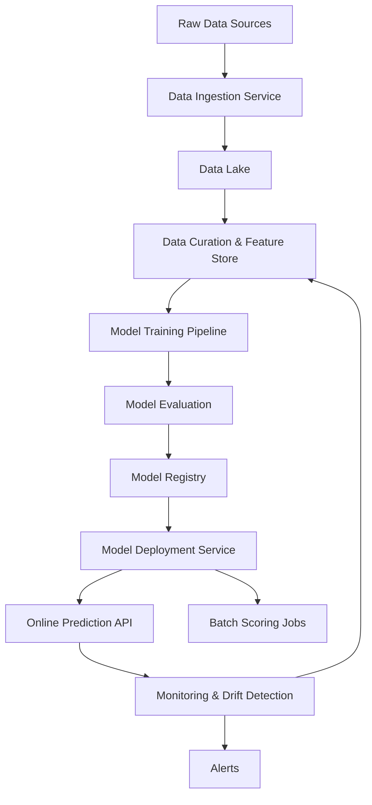

# Machine Learning Pipeline Architecture

## Legend / Roles

- **Data Sources** provide raw input (transactional DBs, logs, external datasets).
- **Ingestion Service** handles ETL/ELT pipelines and data validation.
- **Data Lake** stores raw data; **Feature Store** provides curated features.
- **Training Pipeline** runs experimentation (distributed training, hyperparameter tuning).
- **Model Registry** tracks versions, metadata, and approvals.
- **Deployment Service** orchestrates rollout to real-time APIs and batch jobs.
- **Monitoring** watches health, latency, and prediction drift, triggering alerts and retraining.
