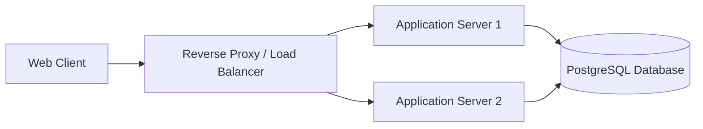

# Client-Server Architecture (Basic)

## Legend / Roles

- **Web Client** initiates requests over HTTPS.
- **Reverse Proxy / Load Balancer** terminates TLS and balances requests.
- **Application Servers** run identical stateless workloads.
- **PostgreSQL Database** stores persistent application data.
