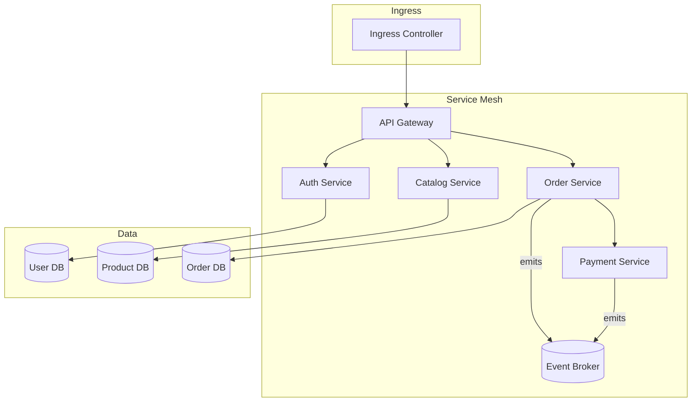

# Cloud-Native on Kubernetes with Service Mesh

## Legend / Roles

- **Ingress Controller** exposes cluster services to the internet.
- **Service Mesh** (Istio/Linkerd) provides traffic management and observability.
- **API Gateway** handles external API routing and auth.
- **Microservices** (Auth, Catalog, Order, Payment) communicate securely within the mesh.
- **Event Broker** supports asynchronous messaging.
- **Per-service Databases** isolate data ownership for each service.
