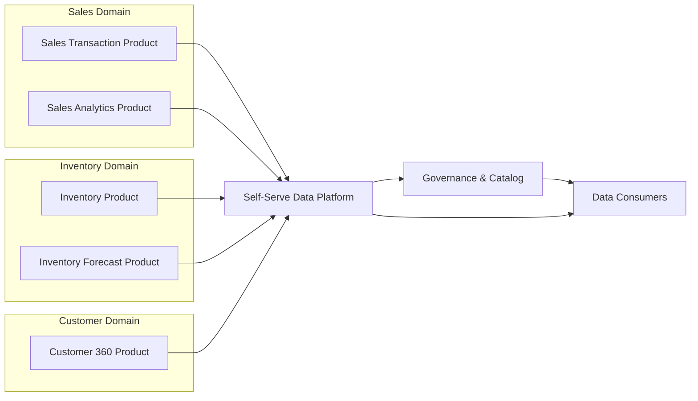

# Data Mesh Domain-Oriented Platform

## Legend / Roles

- **Domain Data Products** encapsulate datasets managed by cross-functional domain teams.
- **Self-Serve Data Platform** provides standardized tooling (data pipelines, storage, observability).
- **Governance & Catalog** maintains metadata, policies, and lineage transparency.
- **Data Consumers** discover and integrate products (analytics, ML, downstream services).
