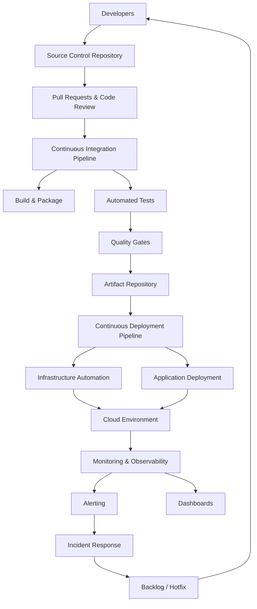

# DevOps Reference Architecture

## Legend / Roles

- **Developers / Source Control**: manage code, run pull requests, and trigger CI.
- **CI Pipeline**: executes builds, automated tests, and quality gates before publishing artifacts.
- **Artifact Repository**: stores versioned deployable packages.
- **CD Pipeline**: orchestrates deployments and infrastructure automation (IaC).
- **Infrastructure Automation**: provisions cloud resources via Terraform/ARM/CloudFormation, etc.
- **Monitoring & Observability**: collects metrics, logs, traces, and routes alerts.
- **Incident Response & Backlog**: feeds operational learnings back into development.
