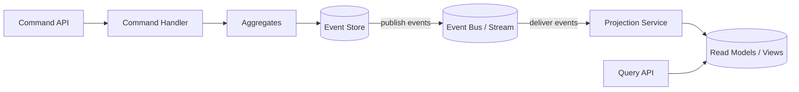

# Event-Driven Architecture with CQRS

## Legend / Roles

- **Command API** receives external requests.
- **Command Handler** validates and routes commands to aggregates.
- **Aggregates** enforce domain invariants and emit events to the store.
- **Event Store** persists domain events and publishes them to the bus.
- **Event Bus / Stream** distributes events to downstream consumers.
- **Projection Service** updates read models in response to events.
- **Read Models / Views** power fast queries through the **Query API**.
