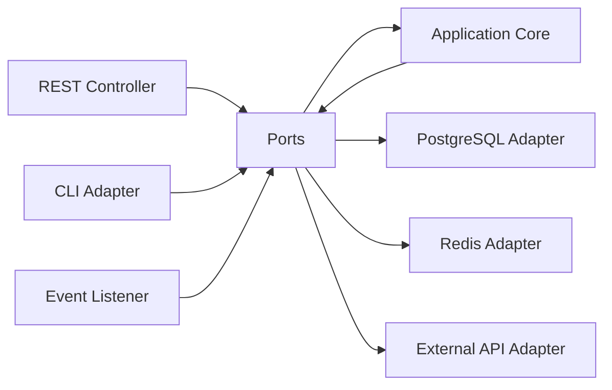

# Hexagonal Architecture (Ports & Adapters)

## Legend / Roles

- **Application Core** contains domain logic without infrastructure details.
- **Ports** define the interfaces the domain expects to use.
- **Inbound Adapters** (REST, CLI, Event) translate external input into port calls.
- **Outbound Adapters** (DB, Cache, External API) implement outbound ports to reach external systems.
