# IoT Edge-to-Cloud Architecture

```mermaid
graph LR
    %% Edge devices
    SENSOR[IoT Sensor Device] --> EDGEGW[Edge Gateway]
    CAMERA[Camera Device] --> EDGEGW

    %% Edge processing
    EDGEGW --> STREAM[Stream Processor]
    STREAM --> LOCALCACHE[Edge Cache]
    STREAM --> CLOUDINGEST[Cloud Ingestion]

    %% Cloud platform
    CLOUDINGEST --> EVENTBUS[Cloud Event Hub]
    EVENTBUS --> FUNCTIONS[Serverless Functions]
    EVENTBUS --> DIGITALTWIN[Digital Twin Service]
    FUNCTIONS --> DATAPROC[Batch Processing]

    %% Persistence and analytics
    DIGITALTWIN --> TIMESERIES[Time-Series Database]
    DATAPROC --> DATAWAREHOUSE[Data Warehouse]
    DATAWAREHOUSE --> BI[BI Dashboards]

%% Notes:
%% - Edge gateway aggregates sensor data, handles protocol translation, and performs local filtering.
%% - Stream processor executes near-real-time analytics, caching recent results at the edge for resilience.
%% - Cloud ingestion pipeline sends events to an event hub for fan-out to serverless compute and digital twin updates.
%% - Batch jobs persist data into analytical stores for dashboards and reporting.
```

## Legend / Roles

- **IoT Devices** generate telemetry and media streams.
- **Edge Gateway** normalizes protocols, handles buffering, and forwards data.
- **Stream Processor** performs real-time aggregation and anomaly detection.
- **Cloud Event Hub** provides scalable ingestion and fan-out for downstream services.
- **Serverless Functions** enrich events and trigger workflows.
- **Digital Twin Service** maintains virtual representations of physical assets.
- **Time-Series Database** stores high-frequency telemetry.
- **Data Warehouse / BI** supports analytics and reporting.
