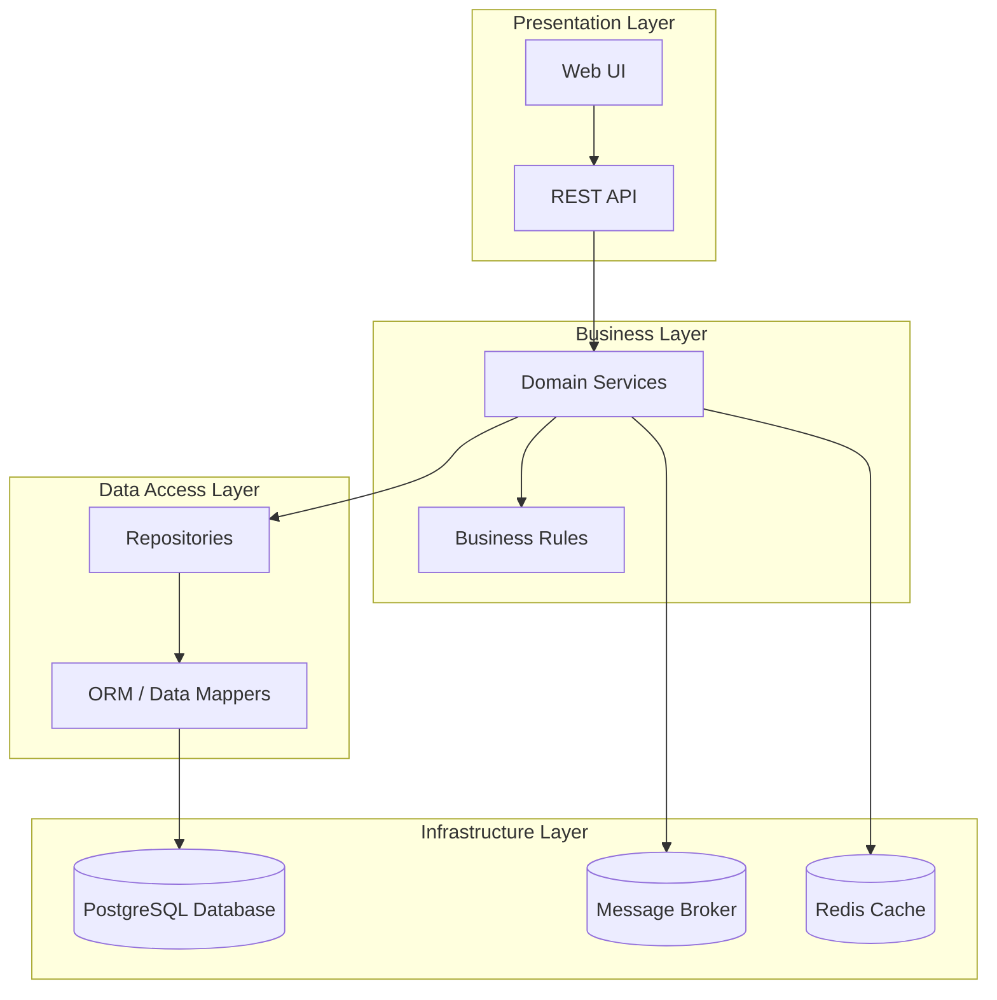

# Layered Architecture

## Legend / Roles

- **Presentation Layer** hosts user interfaces and API endpoints.
- **Business Layer** holds domain services and business rules.
- **Data Access Layer** abstracts persistence interactions.
- **Infrastructure Layer** provides databases, messaging, and caching services.
