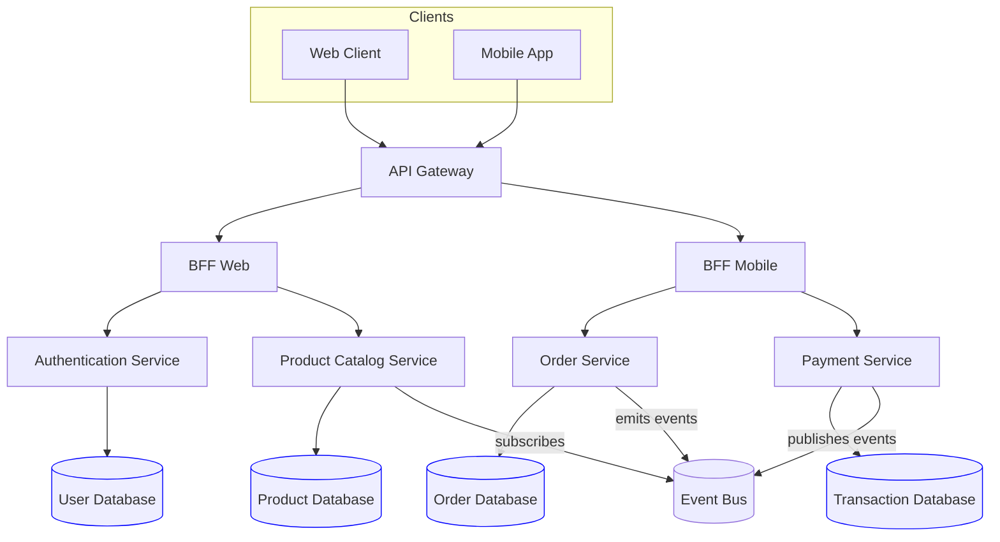

# Microservices: API Gateway + BFF

## Legend / Roles

- **Clients** (Web, Mobile) access the platform through the API Gateway.
- **API Gateway** centralizes routing, authentication, and throttling.
- **BFFs** tailor responses for each client type while delegating to services.
- **Microservices** (Authentication, Catalog, Order, Payment) own their logic and data.
- **Event Bus** propagates domain events for asynchronous workflows.
