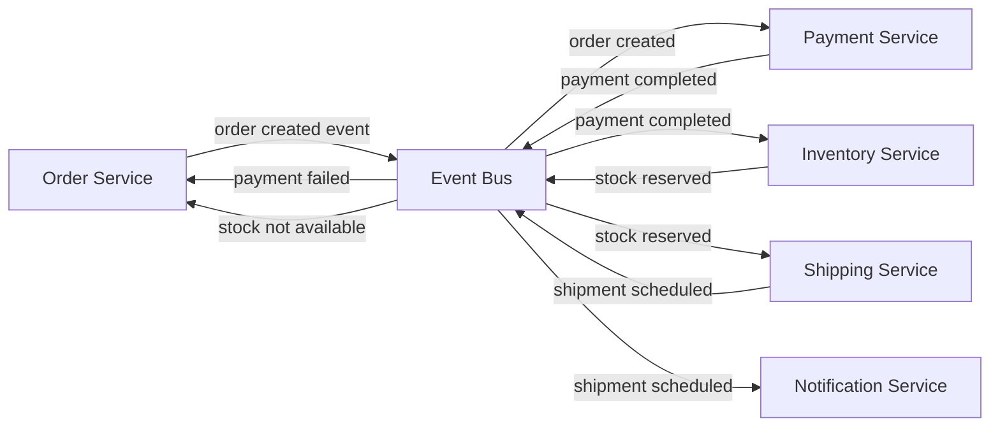

# Microservices Saga (Choreography)

## Legend / Roles

- **Order Service** initiates saga with `order created` events and listens for compensations.
- **Payment Service** processes payments upon order creation events.
- **Inventory Service** reserves stock and emits success/failure events.
- **Shipping Service** schedules delivery when inventory is reserved.
- **Notification Service** informs customers of status updates.
- **Event Bus** distributes events to all interested services.
