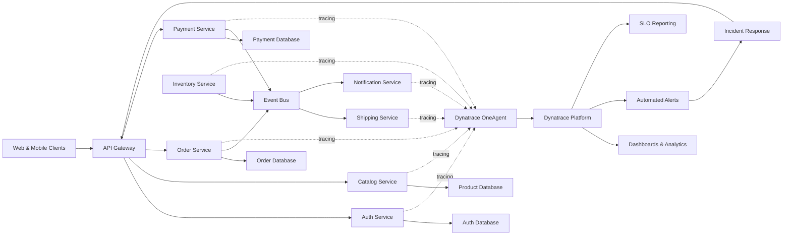

# Modern Microservices with Dynatrace Monitoring

## Legend / Roles

- **API Gateway** secures and routes external traffic to backend services.
- **Domain Services** (Auth, Catalog, Order, Payment, Inventory, Shipping, Notification) encapsulate business capabilities with their own data stores.
- **Event Bus** supports asynchronous workflows and decoupling.
- **Dynatrace OneAgent** collects metrics, traces, and logs automatically from service runtimes.
- **Dynatrace Platform** aggregates observability data, powering dashboards, alerts, and SLOs.
- **Incident Response** uses alerts to triage issues and drive fixes.
