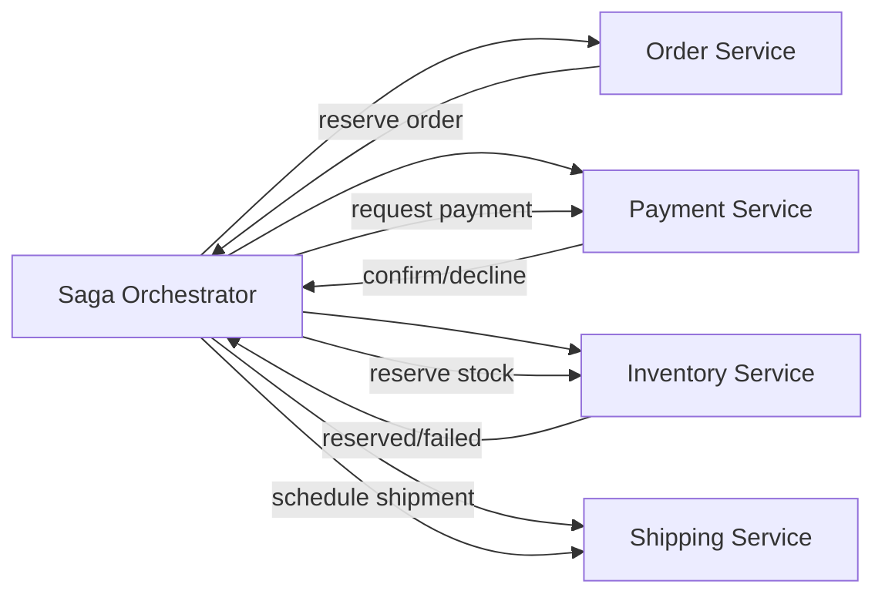

# Microservices Saga (Orchestration)

## Legend / Roles

- **Saga Orchestrator** coordinates the sequence of local transactions.
- **Order Service** creates or cancels orders.
- **Payment Service** captures or refunds payments.
- **Inventory Service** reserves or releases stock.
- **Shipping Service** schedules fulfillment or handles rollback steps.
