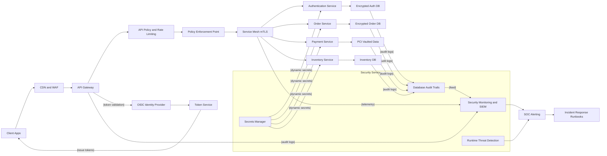

# Secure Microservices with Defense-in-Depth

## Legend / Roles

- **CDN + WAF** absorbs DDoS traffic, caches static assets, and filters malicious requests.
- **API Gateway & Policy Enforcement** validate tokens, apply rate limits, and enforce zero-trust access decisions.
- **Service Mesh** terminates/exchanges mTLS certificates for every internal call and provides fine-grained traffic policies.
- **Domain Services** (Authentication, Order, Payment, Inventory) remain isolated behind the mesh with encrypted data stores.
- **Secrets Manager** rotates dynamic credentials and certificates consumed by services at runtime.
- **SIEM & Runtime Detection** centralize security analytics, trigger SOC alerts, and feed incident response runbooks.
