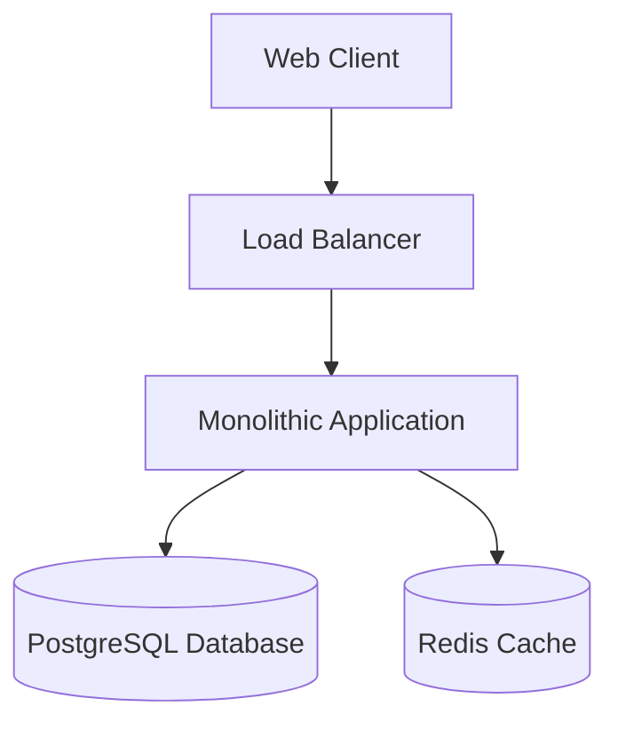

# Monolithic Architecture (Basic)

## Legend / Roles

- **Web Client** issues HTTP requests to the application.
- **Load Balancer** distributes incoming traffic across application instances.
- **Monolithic Application** contains UI, business logic, and data access.
- **PostgreSQL Database** stores persistent data for all application modules.
- **Redis Cache** speeds up repeated reads and session storage.
