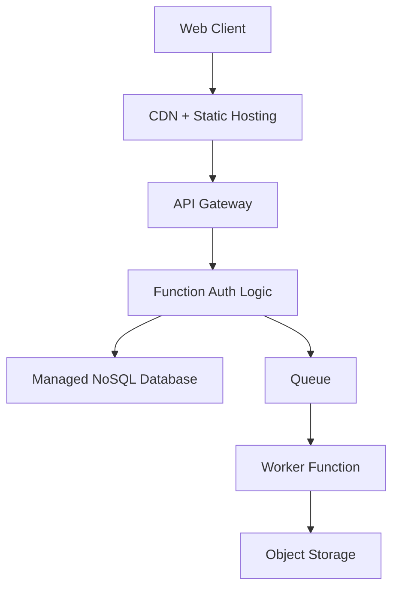

# Serverless Web Backend

## Legend / Roles

- **Web Client** loads static assets and calls APIs.
- **CDN + Static Hosting** serves front-end files from edge locations.
- **API Gateway** authorizes and routes API calls to functions.
- **Functions** run backend logic on demand.
- **Managed NoSQL Database** persists application data.
- **Queue** buffers long-running tasks handled by worker functions.
- **Object Storage** stores generated artifacts or media.
