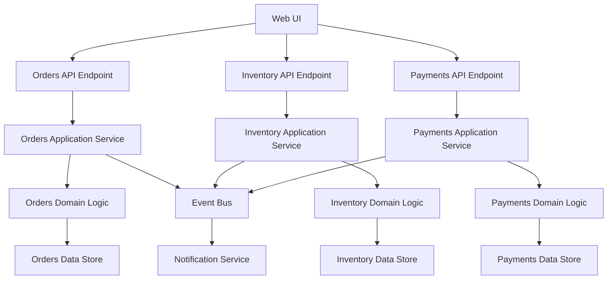

# Vertical Slice Architecture

## Legend / Roles

- **Vertical Slices** represent end-to-end features (Orders, Inventory, Payments).
- **UI** layer routes to feature-specific API endpoints.
- **Application Services** coordinate domain logic within the slice.
- **Domain Logic** encapsulates business rules and workflows.
- **Data Stores** belong to each slice, avoiding cross-slice coupling.
- **Event Bus / Notification** handles cross-cutting integration.
